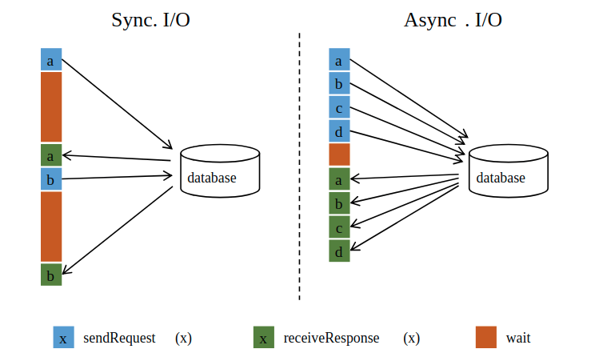

外部数据源异步IO
===
### 异步IO的作用
例如在MapFunction中查询外部数据，同步IO会导致MapFunction阻塞。异步IO可并发发起多个查询，从而提高吞吐率


### 前提
提供异步查询能力的外部数据源的客户端

### 异步IO API
通过异步IO实现流转换：
+ 实现AsyncFunction
+ asyncInvoke(IN var1, ResultFuture<OUT> var2)方法定义转换逻辑
+ 对流应用AsyncFuncion，转换流为一个新的流
```
// This example implements the asynchronous request and callback with Futures that have the
// interface of Java 8's futures (which is the same one followed by Flink's Future)

/**
 * An implementation of the 'AsyncFunction' that sends requests and sets the callback.
 */
class AsyncDatabaseRequest extends RichAsyncFunction<String, Tuple2<String, String>> {

    /** The database specific client that can issue concurrent requests with callbacks */
    private transient DatabaseClient client;

    @Override
    public void open(Configuration parameters) throws Exception {
        client = new DatabaseClient(host, post, credentials);
    }

    @Override
    public void close() throws Exception {
        client.close();
    }

    @Override
    public void asyncInvoke(String key, final ResultFuture<Tuple2<String, String>> resultFuture) throws Exception {

        // issue the asynchronous request, receive a future for result
        final Future<String> result = client.query(key);

        // set the callback to be executed once the request by the client is complete
        // the callback simply forwards the result to the result future
        CompletableFuture.supplyAsync(new Supplier<String>() {

            @Override
            public String get() {
                try {
                    return result.get();
                } catch (InterruptedException | ExecutionException e) {
                    // Normally handled explicitly.
                    return null;
                }
            }
        }).thenAccept( (String dbResult) -> {
            resultFuture.complete(Collections.singleton(new Tuple2<>(key, dbResult)));
        });
    }
}

// create the original stream
DataStream<String> stream = ...;

// apply the async I/O transformation
DataStream<Tuple2<String, String>> resultStream =
    AsyncDataStream.unorderedWait(stream, new AsyncDatabaseRequest(), 1000, TimeUnit.MILLISECONDS, 100);
```
AsyncFunction：

+ asyncInvoke(IN var1, ResultFuture<OUT> var2)转换
+ void timeout(IN input, ResultFuture<OUT> resultFuture)处理超时

ResultFuture：

+ ResultFuture.complete(Collection<OUT> var1)输出转换结果
+ void completeExceptionally(Throwable var1)输出异常，任务重跑

AsyncDataStream：

+ SingleOutputStreamOperator<OUT> unorderedWait(DataStream<IN> in, AsyncFunction<IN, OUT> func, long timeout, TimeUnit timeUnit, int capacity)：无序，延迟低；使用Event Time时，转换结果的Event Time在Watermark后，则必须等待Watermark提交。Watermark提交时，所有Event Time小于Watermark的结果都必须提交
+ SingleOutputStreamOperator<OUT> orderedWait(DataStream<IN> in, AsyncFunction<IN, OUT> func, long timeout, TimeUnit timeUnit, int capacity)：有序

### 容错保证

### 注意事项
+ AsyncFunction只被单个线程调用，AsyncFunction内asyncInvoke阻塞时将导致阻塞