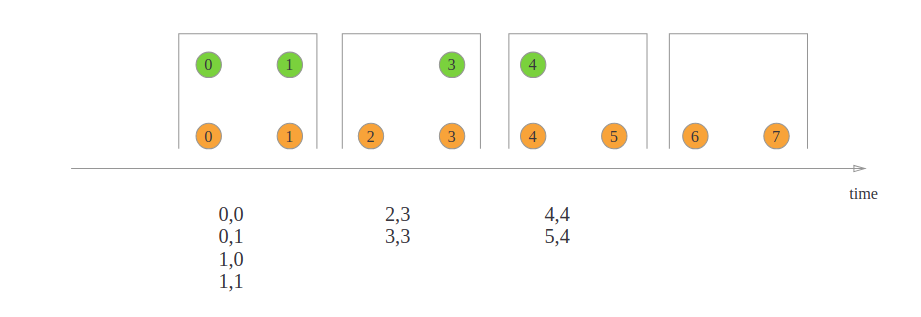
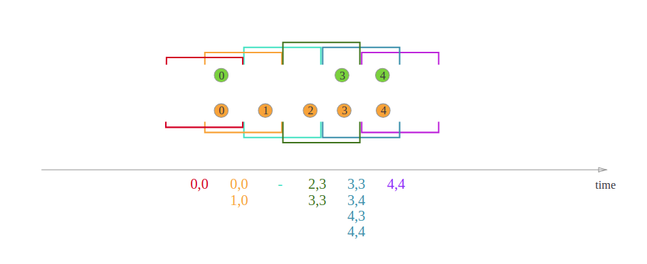
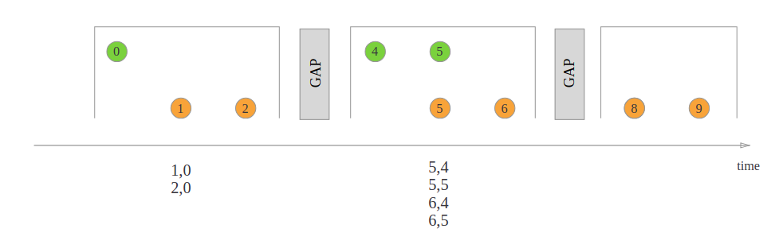
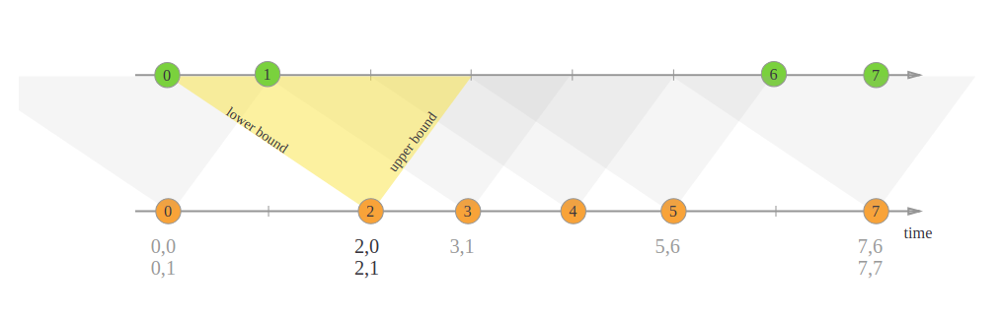

Joining
===
### Window Join
```
stream.join(otherStream)
    .where(<KeySelector>)
    .equalTo(<KeySelector>)
    .window(<WindowAssigner>)
    .apply(<JoinFunction>)
```
##### Tumbling Window Join

```
import org.apache.flink.api.java.functions.KeySelector;
import org.apache.flink.streaming.api.windowing.assigners.TumblingEventTimeWindows;
import org.apache.flink.streaming.api.windowing.time.Time;
 
...

DataStream<Integer> orangeStream = ...
DataStream<Integer> greenStream = ...

orangeStream.join(greenStream)
    .where(<KeySelector>)
    .equalTo(<KeySelector>)
    .window(TumblingEventTimeWindows.of(Time.seconds(2)))
    .apply (new JoinFunction<Integer, Integer, String> (){
        @Override
        public String join(Integer first, Integer second) {
            return first + "," + second;
        }
    });
```
##### Sliding Window Join

```
import org.apache.flink.api.java.functions.KeySelector;
import org.apache.flink.streaming.api.windowing.assigners.SlidingEventTimeWindows;
import org.apache.flink.streaming.api.windowing.time.Time;

...

DataStream<Integer> orangeStream = ...
DataStream<Integer> greenStream = ...

orangeStream.join(greenStream)
    .where(<KeySelector>)
    .equalTo(<KeySelector>)
    .window(SlidingEventTimeWindows.of(Time.milliseconds(2) /* size */, Time.milliseconds(1) /* slide */))
    .apply (new JoinFunction<Integer, Integer, String> (){
        @Override
        public String join(Integer first, Integer second) {
            return first + "," + second;
        }
    });
```
##### Session Window Join

```
import org.apache.flink.api.java.functions.KeySelector;
import org.apache.flink.streaming.api.windowing.assigners.EventTimeSessionWindows;
import org.apache.flink.streaming.api.windowing.time.Time;
 
...

DataStream<Integer> orangeStream = ...
DataStream<Integer> greenStream = ...

orangeStream.join(greenStream)
    .where(<KeySelector>)
    .equalTo(<KeySelector>)
    .window(EventTimeSessionWindows.withGap(Time.milliseconds(1)))
    .apply (new JoinFunction<Integer, Integer, String> (){
        @Override
        public String join(Integer first, Integer second) {
            return first + "," + second;
        }
    });
```
### Interval Join

orangeElem.ts - 2ms <= greenElem.ts <= orangeElem.ts + 1ms
```
import org.apache.flink.api.java.functions.KeySelector;
import org.apache.flink.streaming.api.functions.co.ProcessJoinFunction;
import org.apache.flink.streaming.api.windowing.time.Time;

...

DataStream<Integer> orangeStream = ...
DataStream<Integer> greenStream = ...

orangeStream
    .keyBy(<KeySelector>)
    .intervalJoin(greenStream.keyBy(<KeySelector>))
    .between(Time.milliseconds(-2), Time.milliseconds(1))
    .process (new ProcessJoinFunction<Integer, Integer, String(){

        @Override
        public void processElement(Integer left, Integer right, Context ctx, Collector<String> out) {
            out.collect(first + "," + second);
        }
    });
```