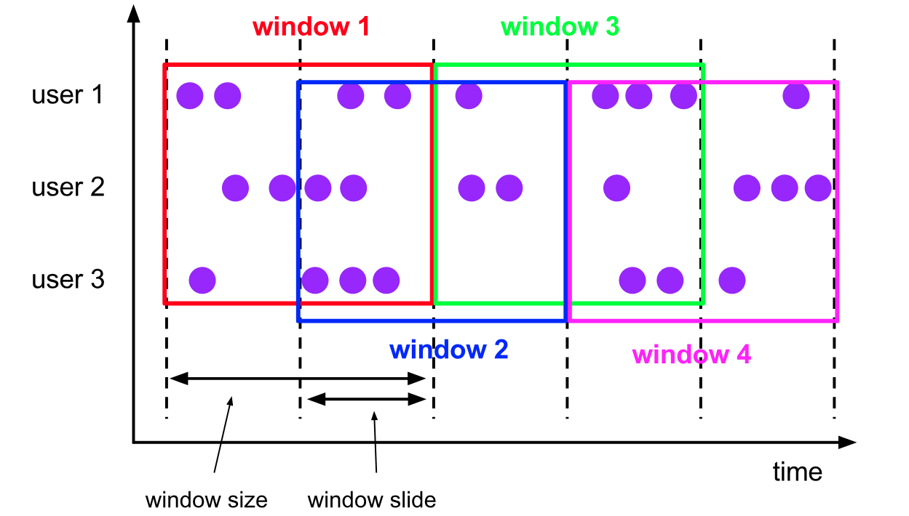

Windows
===
窗口是流的核心，窗口将流切分到有限大小的桶中，让我们可以应用一些聚合计算
分窗口的Flink程序如下，[]是可选项

+ Keyed Windows
```
stream
       .keyBy(...)               <-  keyed versus non-keyed windows
       .window(...)              <-  required: "assigner"
      [.trigger(...)]            <-  optional: "trigger" (else default trigger)
      [.evictor(...)]            <-  optional: "evictor" (else no evictor)
      [.allowedLateness(...)]    <-  optional: "lateness" (else zero)
      [.sideOutputLateData(...)] <-  optional: "output tag" (else no side output for late data)
       .reduce/aggregate/fold/apply()      <-  required: "function"
      [.getSideOutput(...)]      <-  optional: "output tag"
```
+ Non-Keyed Windows
```
stream
       .windowAll(...)           <-  required: "assigner"
      [.trigger(...)]            <-  optional: "trigger" (else default trigger)
      [.evictor(...)]            <-  optional: "evictor" (else no evictor)
      [.allowedLateness(...)]    <-  optional: "lateness" (else zero)
      [.sideOutputLateData(...)] <-  optional: "output tag" (else no side output for late data)
       .reduce/aggregate/fold/apply()      <-  required: "function"
      [.getSideOutput(...)]      <-  optional: "output tag"
```

### Window生命周期
当第一个窗口内的元素到达时，才新建这个窗口，当Watermark大于窗口结束时间加上可容忍的延迟时，窗口关闭
Trigger负责指定窗口就绪可以应用聚合函数的条件，或者清洗窗口数据的条件
聚合函数(ProcessWindowFunction, ReduceFunction, AggregateFunction or FoldFunction)对窗口内数据进行聚合计算
Evictor负责移除窗口内的元素

### Keyed vs Non-Keyed Windows
+ Keyed Window，窗口被应用于每个key，可以多任务并行处理
+ Non-Keyed Windows，窗口被应用与所有数据，单任务运行

### Window Assigners
Window Assigner负责将element划分到Window中。Flink提供默认实现：tumbling windows, sliding windows, session windows and global windows。自定义实现需要继承WindowAssigner

+ Tumbling Windows：滚动窗口

```
DataStream<T> input = ...;

// tumbling event-time windows
input
    .keyBy(<key selector>)
    .window(TumblingEventTimeWindows.of(Time.seconds(5)))
    .<windowed transformation>(<window function>);

// tumbling processing-time windows
input
    .keyBy(<key selector>)
    .window(TumblingProcessingTimeWindows.of(Time.seconds(5)))
    .<windowed transformation>(<window function>);

//每天一个窗口，offset用于调整时区，-8表示16:00:00.000~15:59:59.999
input
    .keyBy(<key selector>)
    .window(TumblingEventTimeWindows.of(Time.days(1), Time.hours(-8)))
    .<windowed transformation>(<window function>);
```

+ Sliding Windows：滑动窗口

```
DataStream<T> input = ...;

// sliding event-time windows
input
    .keyBy(<key selector>)
    .window(SlidingEventTimeWindows.of(Time.seconds(10), Time.seconds(5)))
    .<windowed transformation>(<window function>);

// sliding processing-time windows
input
    .keyBy(<key selector>)
    .window(SlidingProcessingTimeWindows.of(Time.seconds(10), Time.seconds(5)))
    .<windowed transformation>(<window function>);

// sliding processing-time windows offset by -8 hours
input
    .keyBy(<key selector>)
    .window(SlidingProcessingTimeWindows.of(Time.hours(12), Time.hours(1), Time.hours(-8)))
    .<windowed transformation>(<window function>);
```
+ Session Windows：会话窗口，窗口大小取决于会话活跃度。通过gap定义窗口是否活跃，gap可以是静态的也可以是动态的，动态gap通过SessionWindowTimeGapExtractor定义

```
DataStream<T> input = ...;

// event-time session windows with static gap
input
    .keyBy(<key selector>)
    .window(EventTimeSessionWindows.withGap(Time.minutes(10)))
    .<windowed transformation>(<window function>);
    
// event-time session windows with dynamic gap
input
    .keyBy(<key selector>)
    .window(EventTimeSessionWindows.withDynamicGap((element) -> {
        // determine and return session gap
    }))
    .<windowed transformation>(<window function>);

// processing-time session windows with static gap
input
    .keyBy(<key selector>)
    .window(ProcessingTimeSessionWindows.withGap(Time.minutes(10)))
    .<windowed transformation>(<window function>);
    
// processing-time session windows with dynamic gap
input
    .keyBy(<key selector>)
    .window(ProcessingTimeSessionWindows.withDynamicGap((element) -> {
        // determine and return session gap
    }))
    .<windowed transformation>(<window function>);
```
+ Global Windows：全局窗口

```
DataStream<T> input = ...;

input
    .keyBy(<key selector>)
    .window(GlobalWindows.create())
    .<windowed transformation>(<window function>);
```
### Window Functions
Window Functions负责在窗口就绪时处理每个窗口的element。
包括四种：ReduceFunction, AggregateFunction, FoldFunction or ProcessWindowFunction。前三个可以增量聚合，每个element到达时可触发处理，ProcessWindowFunction必须等窗口的所有element到达才能处理

##### ReduceFunction
```
DataStream<Tuple2<String, Long>> input = ...;

input
    .keyBy(<key selector>)
    .window(<window assigner>)
    .reduce(new ReduceFunction<Tuple2<String, Long>> {
      public Tuple2<String, Long> reduce(Tuple2<String, Long> v1, Tuple2<String, Long> v2) {
        return new Tuple2<>(v1.f0, v1.f1 + v2.f1);
      }
    });
```
##### AggregateFunction：聚合函数有需要指定输入类型（IN）、累加器类型（ACC）、输出类型（OUT）
```
/**
 * The accumulator is used to keep a running sum and a count. The {@code getResult} method
 * computes the average.
 */
private static class AverageAggregate
    implements AggregateFunction<Tuple2<String, Long>, Tuple2<Long, Long>, Double> {
  @Override
  public Tuple2<Long, Long> createAccumulator() {
    return new Tuple2<>(0L, 0L);
  }

  @Override
  public Tuple2<Long, Long> add(Tuple2<String, Long> value, Tuple2<Long, Long> accumulator) {
    return new Tuple2<>(accumulator.f0 + value.f1, accumulator.f1 + 1L);
  }

  @Override
  public Double getResult(Tuple2<Long, Long> accumulator) {
    return ((double) accumulator.f0) / accumulator.f1;
  }

  @Override
  public Tuple2<Long, Long> merge(Tuple2<Long, Long> a, Tuple2<Long, Long> b) {
    return new Tuple2<>(a.f0 + b.f0, a.f1 + b.f1);
  }
}

DataStream<Tuple2<String, Long>> input = ...;

input
    .keyBy(<key selector>)
    .window(<window assigner>)
    .aggregate(new AverageAggregate());
```
##### FoldFunction：用于指定输入Element和输出聚合
```
DataStream<Tuple2<String, Long>> input = ...;

input
    .keyBy(<key selector>)
    .window(<window assigner>)
    .fold("", new FoldFunction<Tuple2<String, Long>, String>> {
       public String fold(String acc, Tuple2<String, Long> value) {
         return acc + value.f1;
       }
    });
```
##### ProcessWindowFunction：提供窗口内的所有Element和Context对象（可获取Time和State），对窗口数据进行自定义处理，不能增量计算
```
public abstract class ProcessWindowFunction<IN, OUT, KEY, W extends Window> implements Function {

    /**
     * Evaluates the window and outputs none or several elements.
     *
     * @param key The key for which this window is evaluated.
     * @param context The context in which the window is being evaluated.
     * @param elements The elements in the window being evaluated.
     * @param out A collector for emitting elements.
     *
     * @throws Exception The function may throw exceptions to fail the program and trigger recovery.
     */
    public abstract void process(
            KEY key,
            Context context,
            Iterable<IN> elements,
            Collector<OUT> out) throws Exception;

   	/**
   	 * The context holding window metadata.
   	 */
   	public abstract class Context implements java.io.Serializable {
   	    /**
   	     * Returns the window that is being evaluated.
   	     */
   	    public abstract W window();

   	    /** Returns the current processing time. */
   	    public abstract long currentProcessingTime();

   	    /** Returns the current event-time watermark. */
   	    public abstract long currentWatermark();

   	    /**
   	     * State accessor for per-key and per-window state.
   	     *
   	     * <p><b>NOTE:</b>If you use per-window state you have to ensure that you clean it up
   	     * by implementing {@link ProcessWindowFunction#clear(Context)}.
   	     */
   	    public abstract KeyedStateStore windowState();

   	    /**
   	     * State accessor for per-key global state.
   	     */
   	    public abstract KeyedStateStore globalState();
   	}

}
```
举例：
```
DataStream<Tuple2<String, Long>> input = ...;

input
  .keyBy(t -> t.f0)
  .timeWindow(Time.minutes(5))
  .process(new MyProcessWindowFunction());

/* ... */

public class MyProcessWindowFunction 
    extends ProcessWindowFunction<Tuple2<String, Long>, String, String, TimeWindow> {

  @Override
  public void process(String key, Context context, Iterable<Tuple2<String, Long>> input, Collector<String> out) {
    long count = 0;
    for (Tuple2<String, Long> in: input) {
      count++;
    }
    out.collect("Window: " + context.window() + "count: " + count);
  }
}
```
### ProcessWindowFunction增量聚合
##### 通过ReduceFunction实现ProcessWindowFunction增量聚合
```
DataStream<SensorReading> input = ...;

input
  .keyBy(<key selector>)
  .timeWindow(<duration>)
  .reduce(new MyReduceFunction(), new MyProcessWindowFunction());

// Function definitions

private static class MyReduceFunction implements ReduceFunction<SensorReading> {

  public SensorReading reduce(SensorReading r1, SensorReading r2) {
      return r1.value() > r2.value() ? r2 : r1;
  }
}

private static class MyProcessWindowFunction
    extends ProcessWindowFunction<SensorReading, Tuple2<Long, SensorReading>, String, TimeWindow> {

  public void process(String key,
                    Context context,
                    Iterable<SensorReading> minReadings,
                    Collector<Tuple2<Long, SensorReading>> out) {
      SensorReading min = minReadings.iterator().next();
      out.collect(new Tuple2<Long, SensorReading>(window.getStart(), min));
  }
}
```
##### 通过AggregateFunction实现ProcessWindowFunction增量聚合
```
DataStream<Tuple2<String, Long>> input = ...;

input
  .keyBy(<key selector>)
  .timeWindow(<duration>)
  .aggregate(new AverageAggregate(), new MyProcessWindowFunction());

// Function definitions

/**
 * The accumulator is used to keep a running sum and a count. The {@code getResult} method
 * computes the average.
 */
private static class AverageAggregate
    implements AggregateFunction<Tuple2<String, Long>, Tuple2<Long, Long>, Double> {
  @Override
  public Tuple2<Long, Long> createAccumulator() {
    return new Tuple2<>(0L, 0L);
  }

  @Override
  public Tuple2<Long, Long> add(Tuple2<String, Long> value, Tuple2<Long, Long> accumulator) {
    return new Tuple2<>(accumulator.f0 + value.f1, accumulator.f1 + 1L);
  }

  @Override
  public Double getResult(Tuple2<Long, Long> accumulator) {
    return ((double) accumulator.f0) / accumulator.f1;
  }

  @Override
  public Tuple2<Long, Long> merge(Tuple2<Long, Long> a, Tuple2<Long, Long> b) {
    return new Tuple2<>(a.f0 + b.f0, a.f1 + b.f1);
  }
}

private static class MyProcessWindowFunction
    extends ProcessWindowFunction<Double, Tuple2<String, Double>, String, TimeWindow> {

  public void process(String key,
                    Context context,
                    Iterable<Double> averages,
                    Collector<Tuple2<String, Double>> out) {
      Double average = averages.iterator().next();
      out.collect(new Tuple2<>(key, average));
  }
}
```
##### 通过FoldFunction实现ProcessWindowFunction增量聚合
```
DataStream<SensorReading> input = ...;

input
  .keyBy(<key selector>)
  .timeWindow(<duration>)
  .fold(new Tuple3<String, Long, Integer>("",0L, 0), new MyFoldFunction(), new MyProcessWindowFunction())

// Function definitions

private static class MyFoldFunction
    implements FoldFunction<SensorReading, Tuple3<String, Long, Integer> > {

  public Tuple3<String, Long, Integer> fold(Tuple3<String, Long, Integer> acc, SensorReading s) {
      Integer cur = acc.getField(2);
      acc.setField(cur + 1, 2);
      return acc;
  }
}

private static class MyProcessWindowFunction
    extends ProcessWindowFunction<Tuple3<String, Long, Integer>, Tuple3<String, Long, Integer>, String, TimeWindow> {

  public void process(String key,
                    Context context,
                    Iterable<Tuple3<String, Long, Integer>> counts,
                    Collector<Tuple3<String, Long, Integer>> out) {
    Integer count = counts.iterator().next().getField(2);
    out.collect(new Tuple3<String, Long, Integer>(key, context.window().getEnd(),count));
  }
}
```
### 在ProcessWindowFunction中使用per-window state
ProcessWindowFunction的process方法Context提供两种State：

+ globalState()：每个key一个State
+ windowState()：每个key每个Window一个State

### WindowFunction (废弃)
功能上，是ProcessWindowFunction的弱化版
```
public interface WindowFunction<IN, OUT, KEY, W extends Window> extends Function, Serializable {

  /**
   * Evaluates the window and outputs none or several elements.
   *
   * @param key The key for which this window is evaluated.
   * @param window The window that is being evaluated.
   * @param input The elements in the window being evaluated.
   * @param out A collector for emitting elements.
   *
   * @throws Exception The function may throw exceptions to fail the program and trigger recovery.
   */
  void apply(KEY key, W window, Iterable<IN> input, Collector<OUT> out) throws Exception;
}
```
### Triggers
Trigger指定Window就绪，可以被WIndow Function处理
定义了以下回调事件：

+ onElement()：Element到达窗口
+ onEventTime()：Event Time定时器触发
+ onProcessingTime()：Process Time定时器触发
+ onMerge()：window merge触发
+ clear()：Window移除触发

TriggerResult定义是否触发：

+ CONTINUE: 忽略
+ FIRE: 触发计算
+ PURGE: 清理窗口内Element
+ FIRE_AND_PURGE: 触发计算，然后清理窗口内Element

默认实现：

+ EventTimeTrigger：Watermark到达Window end时fire
+ ProcessingTimeTrigger：基于Process Time fire window
+ CountTrigger：窗口内Element超过限制
+ PurgingTrigger
+ NeverTrigger：不触发，GlobalWindow的默认实现

### Evictors
Evictor指定在Trigger后（Window Function前或后）从Window中移除Element
```
/**
 * Optionally evicts elements. Called before windowing function.
 *
 * @param elements The elements currently in the pane.
 * @param size The current number of elements in the pane.
 * @param window The {@link Window}
 * @param evictorContext The context for the Evictor
 */
void evictBefore(Iterable<TimestampedValue<T>> elements, int size, W window, EvictorContext evictorContext);

/**
 * Optionally evicts elements. Called after windowing function.
 *
 * @param elements The elements currently in the pane.
 * @param size The current number of elements in the pane.
 * @param window The {@link Window}
 * @param evictorContext The context for the Evictor
 */
void evictAfter(Iterable<TimestampedValue<T>> elements, int size, W window, EvictorContext evictorContext);
```
Flink提供的Evictor：

+ CountEvictor: 保留一定数量的Element，先到先驱逐
+ DeltaEvictor: 最后到达的Element和其余Element的差值，驱逐差值大于阈值的Element
+ TimeEvictor: 驱逐最大时间-时间戳大于interval的Element

### 允许延迟
当Watermark > Window end + allow lateness时，窗口才关闭
```
DataStream<T> input = ...;

input
    .keyBy(<key selector>)
    .window(<window assigner>)
    .allowedLateness(<time>)
    .<windowed transformation>(<window function>);
```

输出迟到数据到流中
```
final OutputTag<T> lateOutputTag = new OutputTag<T>("late-data"){};

DataStream<T> input = ...;

SingleOutputStreamOperator<T> result = input
    .keyBy(<key selector>)
    .window(<window assigner>)
    .allowedLateness(<time>)
    .sideOutputLateData(lateOutputTag)
    .<windowed transformation>(<window function>);

DataStream<T> lateStream = result.getSideOutput(lateOutputTag);
```

晚到的Element会导致Fire，称为late firing

### window结果
watermark到达Window Operator时，触发两件事：

+ 触发窗口计算
+ 向下游传播Watermark

举例：
```
DataStream<Integer> input = ...;

DataStream<Integer> resultsPerKey = input
    .keyBy(<key selector>)
    .window(TumblingEventTimeWindows.of(Time.seconds(5)))
    .reduce(new Summer());

DataStream<Integer> globalResults = resultsPerKey
    .windowAll(TumblingEventTimeWindows.of(Time.seconds(5)))
    .process(new TopKWindowFunction());
```

### State大小评估的建议
+ 合理使用 Sliding Window
+ ReduceFunction, AggregateFunction, and FoldFunction可以增量聚合数据
+ 使用驱逐器
