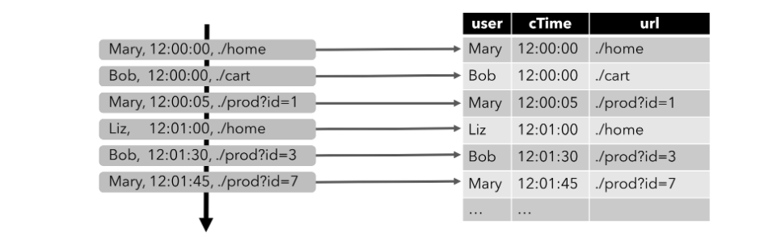
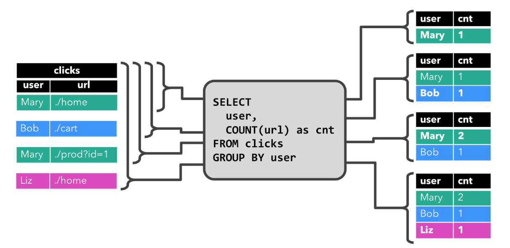
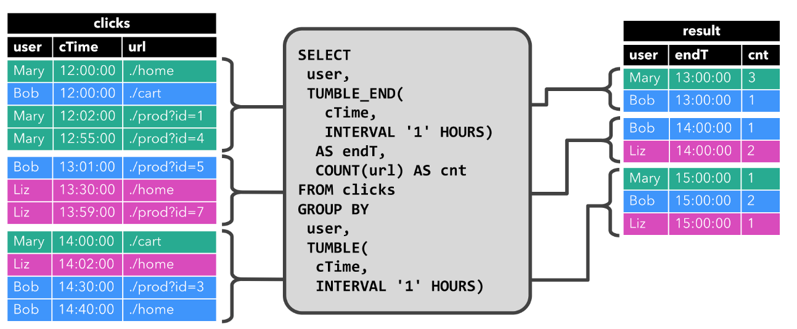
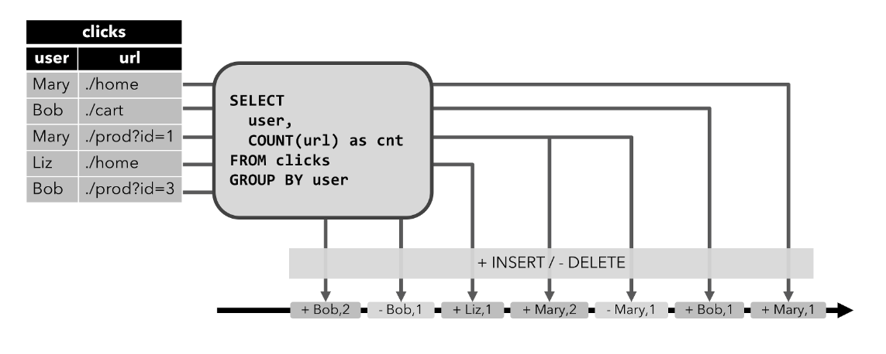
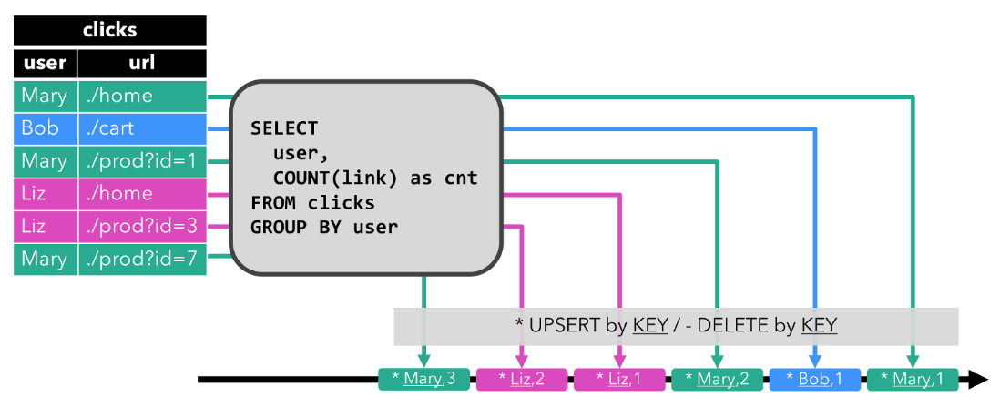

Streaming Concepts
===

### Relational Queries on Data Streams

Relational Algebra / SQL 和 Stream Processing 的区别：
+ 关系型数据是有限的元组，流是无限的
+ 关系代数和SQL可以访问完整的输入数据，流必须等待数据流入
+ 关系代数和SQL产出结果后终止，流在接受到新数据时不断更新结果

+ 数据库表可以看做是insert、update、delete等DML语句的changlog的流
+ 视图是SQL查询，为了更新视图，查询不断处理change log流
+ 视图是流SQL查询的结果

### Dynamic Tables & Continuous Queries
相对于批数据，Dynamic Table是实时改变的。Continuous Query查询Dynamic Table，并生成新的Dynamic Table。Dynamic Table是逻辑上概念


+ Stream转换为Dynamic Table
+ Continuous Query处理Dynamic Table，生成新的Dynamic Table
+ Dynamic Table转换为Dynamic Table

已点击事件流为例，schema如下：
```
[ 
  user:  VARCHAR,   // the name of the user
  cTime: TIMESTAMP, // the time when the URL was accessed
  url:   VARCHAR    // the URL that was accessed by the user
]
```

在Stream上定义Table，每个点击事件都是对Table的一次insert操作



在点击事件流上展示Continuous Queries的两个例子：
1、 GROUP-BY COUNT聚合查询：根据用户分组，统计url访问次数


查询产出的结果表需要更新，这意味着它需要维护更多State

2、 小时级的Tumbling Window上的GROUP-BY COUNT聚合查询：以小时为窗口，根据用户分组，统计url访问次数


查询产出表仅包含insert操作

查询的限制：

+ State大小限制
+ 计算需要更新大量数据

表到流的转换有以下三种模式：

+ Append-only stream：动态表只有insert操作时
+ Retract stream：流中包含add和retract两种消息，insert操作转换为add消息，delete操作转换为retract消息，update操作转换为retract和add消息

+ Upsert stream：流中包含upsert和retract两种消息。动态表必须有unique key


### Time Attributes
Table程序需要指定时间类型，用于后续Window等操作
```
final StreamExecutionEnvironment env = StreamExecutionEnvironment.getExecutionEnvironment();

env.setStreamTimeCharacteristic(TimeCharacteristic.ProcessingTime); // default

// alternatively:
// env.setStreamTimeCharacteristic(TimeCharacteristic.IngestionTime);
// env.setStreamTimeCharacteristic(TimeCharacteristic.EventTime);
```
##### Procession Time
定义Processiong Time：

+ 声明Stream转换Table时
```
DataStream<Tuple2<String, String>> stream = ...;

// declare an additional logical field as a processing time attribute
Table table = tEnv.fromDataStream(stream, "Username, Data, UserActionTime.proctime");

WindowedTable windowedTable = table.window(Tumble.over("10.minutes").on("UserActionTime").as("userActionWindow"));
```
+ TableSource实现DefinedProctimeAttribute接口
```
// define a table source with a processing attribute
public class UserActionSource implements StreamTableSource<Row>, DefinedProctimeAttribute {

	@Override
	public TypeInformation<Row> getReturnType() {
		String[] names = new String[] {"Username" , "Data"};
		TypeInformation[] types = new TypeInformation[] {Types.STRING(), Types.STRING()};
		return Types.ROW(names, types);
	}

	@Override
	public DataStream<Row> getDataStream(StreamExecutionEnvironment execEnv) {
		// create stream 
		DataStream<Row> stream = ...;
		return stream;
	}

	@Override
	public String getProctimeAttribute() {
		// field with this name will be appended as a third field 
		return "UserActionTime";
	}
}

// register table source
tEnv.registerTableSource("UserActions", new UserActionSource());

WindowedTable windowedTable = tEnv
	.scan("UserActions")
	.window(Tumble.over("10.minutes").on("UserActionTime").as("userActionWindow"));
```

##### Event Time
+ 声明Stream转换Table时
```
// Option 1:

// extract timestamp and assign watermarks based on knowledge of the stream
DataStream<Tuple2<String, String>> stream = inputStream.assignTimestampsAndWatermarks(...);

// declare an additional logical field as an event time attribute
Table table = tEnv.fromDataStream(stream, "Username, Data, UserActionTime.rowtime");


// Option 2:

// extract timestamp from first field, and assign watermarks based on knowledge of the stream
DataStream<Tuple3<Long, String, String>> stream = inputStream.assignTimestampsAndWatermarks(...);

// the first field has been used for timestamp extraction, and is no longer necessary
// replace first field with a logical event time attribute
Table table = tEnv.fromDataStream(stream, "UserActionTime.rowtime, Username, Data");

// Usage:

WindowedTable windowedTable = table.window(Tumble.over("10.minutes").on("UserActionTime").as("userActionWindow"));
```
+ TableSource实现DefinedRowtimeAttribute接口
```
// define a table source with a rowtime attribute
public class UserActionSource implements StreamTableSource<Row>, DefinedRowtimeAttribute {

	@Override
	public TypeInformation<Row> getReturnType() {
		String[] names = new String[] {"Username", "Data", "UserActionTime"};
		TypeInformation[] types = 
		    new TypeInformation[] {Types.STRING(), Types.STRING(), Types.LONG()};
		return Types.ROW(names, types);
	}

	@Override
	public DataStream<Row> getDataStream(StreamExecutionEnvironment execEnv) {
		// create stream 
		// ...
		// assign watermarks based on the "UserActionTime" attribute
		DataStream<Row> stream = inputStream.assignTimestampsAndWatermarks(...);
		return stream;
	}

	@Override
	public String getRowtimeAttribute() {
		// Mark the "UserActionTime" attribute as event-time attribute.
		return "UserActionTime";
	}
}

// register the table source
tEnv.registerTableSource("UserActions", new UserActionSource());

WindowedTable windowedTable = tEnv
	.scan("UserActions")
	.window(Tumble.over("10.minutes").on("UserActionTime").as("userActionWindow"));
```

### Query Configuration
使用QueryConfig配置查询准确度和资源使用
```
StreamExecutionEnvironment env = StreamExecutionEnvironment.getExecutionEnvironment();
StreamTableEnvironment tableEnv = TableEnvironment.getTableEnvironment(env);

// obtain query configuration from TableEnvironment
StreamQueryConfig qConfig = tableEnv.queryConfig();
// set query parameters
qConfig.withIdleStateRetentionTime(Time.hours(12), Time.hours(24));

// define query
Table result = ...

// create TableSink
TableSink<Row> sink = ...

// emit result Table via a TableSink
result.writeToSink(sink, qConfig);

// convert result Table into a DataStream<Row>
DataStream<Row> stream = tableEnv.toAppendStream(result, Row.class, qConfig);
```

Idle State Retention Time表示空闲State的保留时间：
```
StreamQueryConfig qConfig = ...

// set idle state retention time: min = 12 hours, max = 24 hours
qConfig.withIdleStateRetentionTime(Time.hours(12), Time.hours(24));
```