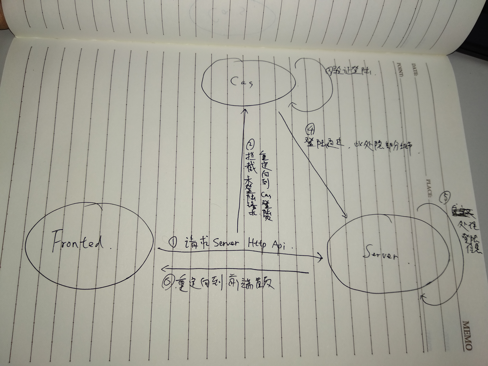

cas单点登录
===
cas是美国忘了哪个大学搞出来的一套登录，国内挺流行的，pdd用统一登录
---
依赖
---
* compile "net.unicon.cas:cas-client-autoconfig-support:$casVersion"
* 这是1.x版本的cas，好像3.x的包不一样

cas思路理顺
---
* 对前后端不分离的系统：
	
* 对前后端分离的系统：
	
    * 前后端交互需要Cors跨域验证，所以后端是实现了Cors的
    * 但是Cas没有实现Cas，所以Cas要求前端重定向时请求失败，但是后端重定向到cas是可以的
    * cas对于每个请求都返回302，而Cors中，post前会先options，options为302时，前端请求后端会失败，需要自定义拦截器

代码怎么写
---
* Cas配置类
```
@Configuration
@EnableCasClient
public class CasConfig extends CasClientConfigurerAdapter {

    static {
        System.setProperty("cas.serverUrlPrefix", LionUtils.getProperty("galerie-base.cas.server-url"));
        System.setProperty("cas.serverLoginUrl", LionUtils.getProperty("galerie-base.cas.server-url") + "/login");
        System.setProperty(
                "cas.clientHostUrl", LionUtils.getProperty("galerie-base.cas.host-url"));
        System.setProperty("cas.validationType", "CAS");
    }

    @Override
    public void configureAuthenticationFilter(FilterRegistrationBean authenticationFilter) {
        super.configureAuthenticationFilter(authenticationFilter);
        authenticationFilter.getInitParameters().put("authenticationRedirectStrategyClass", CustomAuthenticationRedirectStrategy.class.getName());
        authenticationFilter.addUrlPatterns("/*");
    }

}
```
* 重定向策略
```
public class CustomAuthenticationRedirectStrategy implements AuthenticationRedirectStrategy {
    private final Logger logger = LoggerFactory.getLogger(CustomAuthenticationRedirectStrategy.class);

    @Override
    public void redirect(HttpServletRequest request, HttpServletResponse response, String potentialRedirectUrl) throws IOException {
        if (request.getMethod().toLowerCase().equals("options")) {
            response.setHeader("Access-Control-Allow-Origin", request.getHeader("origin"));
            response.setHeader("Access-Control-Allow-Credentials", "true");
            response.setHeader("Access-Control-Allow-Methods", "*");
            response.addHeader("Access-Control-Allow-Headers", "Origin, No-Cache, X-Requested-With, If-Modified-Since, Pragma, Last-Modified, Cache-Control, Expires, Content-Type, X-E4M-With");
            response.setStatus(200);
        } else {
            response.sendRedirect(potentialRedirectUrl);
        }
    }
}
```
* /redirect接口
```
@Controller
@Slf4j
@RequestMapping("/user")
public class UserAuthController {

    private static final String WEB_URL = LionUtils.getProperty("galerie-base.web.url");

    @Autowired
    private HttpServletRequest request;

    @Autowired
    private UserMapper userMapper;

    @RequestMapping("/redirect")
    public String redirect(){
        return "redirect:" + WEB_URL;
    }

    @RequestMapping(value = "/me", method = RequestMethod.GET)
    @ResponseBody
    public Object getCurrentUser(){
        String userName = request.getUserPrincipal().toString();
        User currentUser = new User().setUserName(userName);
        if(Objects.isNull(userMapper.selectByName(currentUser))){
            userMapper.insert(new User().setUserName(userName).setIsAdmin(false));
        }
        currentUser = userMapper.selectByName(currentUser);
        return BaseResponse.newSuccResponse().result(new CurrentUserResponse().setId(currentUser.getId())
                .setIsAdmin(currentUser.getIsAdmin())
                .setUserName(currentUser.getUserName())).build();
    }

}
```
* 前端请求失败时重定向到后端/redirect接口
```
Axios.interceptors.response.use((response) => {
        return response;
      }, (error) => {
        window.location.href = DEV_API_URL + '/user/redirect';
        return error;
      });
```